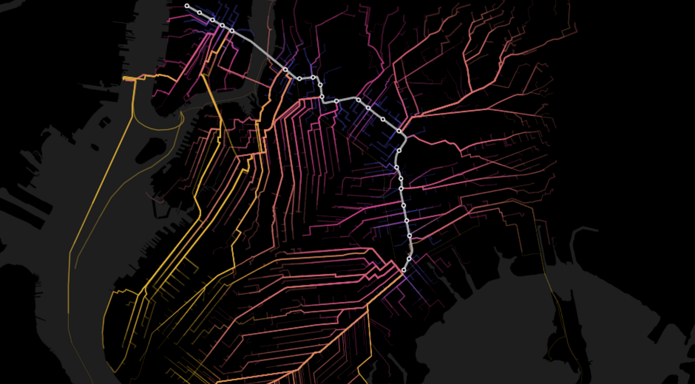
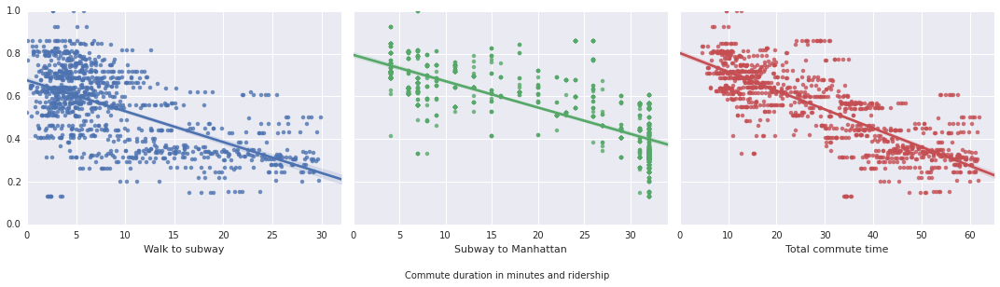

# The Subway Series: A disruption of epic proportions

[](https://team.cartodb.com/u/mamataakella/viz/fdbcdcba-bd4f-11e5-b5f0-0e674067d321/embed_map)

Early last week, news came out that New York's Metropolitan Transit Authority (MTA) was considering how to repair damages to the tunnel used by the L train to connect Manhattan and Brooklyn. The damages were caused by flooding during 2012's Hurricane Sandy and their repair may have big consequences to L train riders in the near future. As the MTA weighs the options, which include a full closing of the L train during repairs, or a longer period with weekend only closures, CartoDB wanted to dig in and look at what L train disruption looked like to the population of Brooklyn who rely on this train. How many, what backgrounds, and what alternatives are out there for what may come to the L.

Today, we want to dig into what an L train outage means related to the riders and the locations it serves.

## The L Train

If you live in New York City, you probably know a fair bit about the MTA's L train. It is this East-West artery of the city, which connects Manhattan with much of northern Brooklyn. Even if you are not from NYC you have heard of many of the neighborhoods that the L train serves: from Chelsea to Williamsburg, Bushwick, and Canarsie among others. In recent years, it has been one of the fastest growing subway lines in terms of ridership, with just the Bedford Avenue stop in Williamsburg seeing [27,224 average weekday customers](http://www.mta.info/news-subway-new-york-city-transit/2015/04/20/subway-ridership-surges-26-one-year) back in 2014.

There is more to the L train than numbers alone. If you know people who live in Williamsburg and commute to Manhattan in the morning, you've probably heard the stories of morning commutes where only place to put your arms is on shoulders of the people standing beside you. Besides the crowds, the L is a pretty convenient train. As the only [CBTC enabled](https://en.wikipedia.org/wiki/Automation_of_the_New_York_City_Subway#Canarsie_Line_CBTC) line, L trains come almost every 2 minutes.

(We starting thinking that many of the inhabitants along the L line who work in Manhattan, likely chose the line for it's conveniently close proximity to work.)
(need to fix the below. right now Y=%Riders in each block. Need Y=%Riders to Manhattan in each block)



(but people can't always move)

##

```
UPDATE total_time_to_manhattan_2 
SET az_route = 
    CASE WHEN az_s_cost+az_time_to_s + 29 < least(az_a_cost+az_time_to_a, az_m_cost+ az_time_to_m) 
         THEN 'S' 
         ELSE CASE WHEN az_a_cost+az_time_to_a < az_m_cost + az_time_to_m 
                   THEN 'A' 
                   ELSE 'M'
              END
         END
```

```
SELECT 
  sum(subway_elevated_public_transit_commuters_16_and_over), 
  az_route 
FROM 
  total_time_to_manhattan_2 
GROUP BY 
  az_route
```


## A disruption of epic proportions

More than  that, the L train services.... [STUB IN AGE, INCOME, FAMILY SIZE]

(VISUAL)

### Who is using the L?

The MTA periodically releases data about [subway ridership](http://web.mta.info/nyct/facts/ridership/) but knowing who those people are takes a bit more work.

(Waitig on Visuals we can use)
