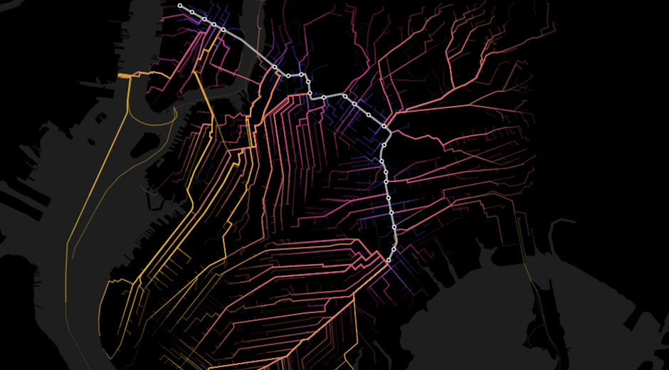
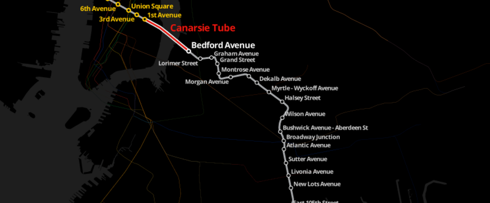
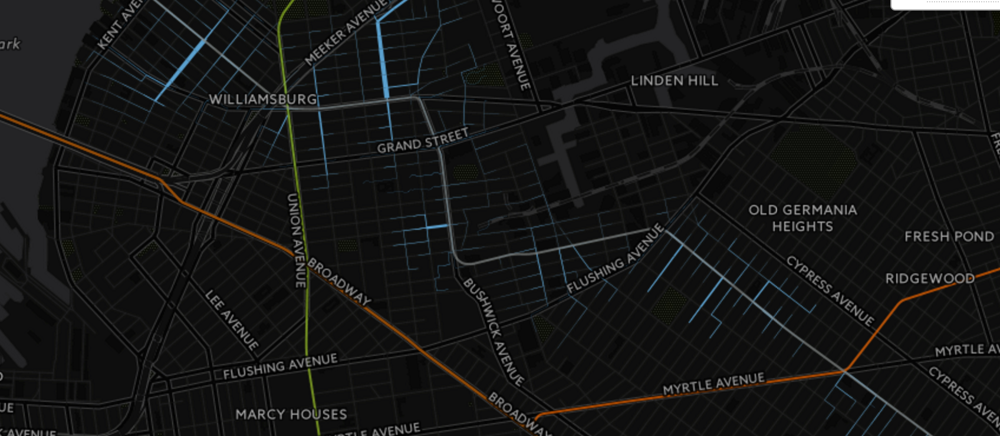
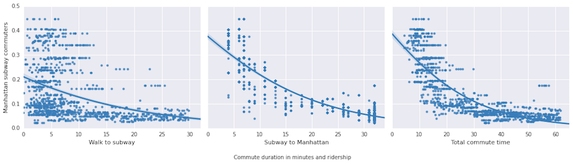
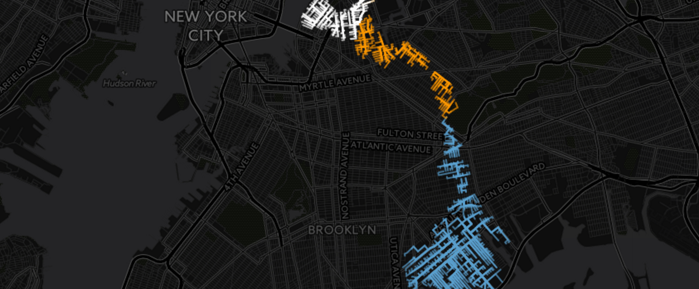
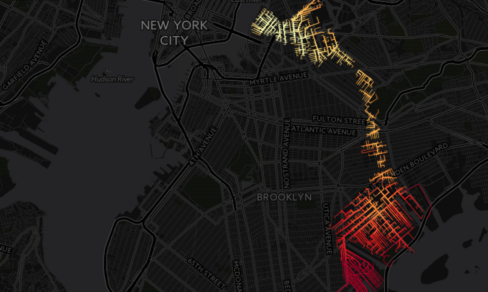
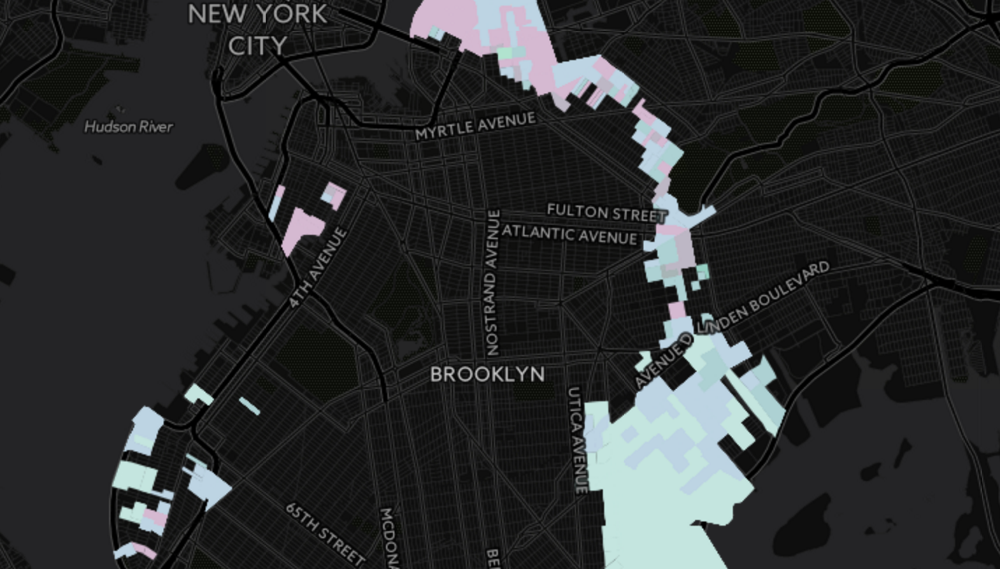

# Title pending

[](https://team.cartodb.com/u/mamataakella/viz/fdbcdcba-bd4f-11e5-b5f0-0e674067d321/embed_map)

Last week brought news that New York's Metropolitan Transit Authority (MTA) was considering how to repair damage to the Canarsie Tunnel, the vital connection used by the L train to connect Manhattan and Brooklyn under the East River. The damage was caused by flooding from 2012's Hurricane Sandy, and the closures for the repairs will in all likelihood have large consequences for L train riders in the near future.

As the MTA weighs its options -- which include a full closing of the L train during repairs, or a longer period with weekend only closures -- CartoDB started digging into open data to shed some light on how disruptive the L train closure would be to the people living in Brooklyn. We specifically want to see,

1. Who cares about the L?
2. Is there a realistic alternative?

### Overview of the L Train

[](https://team.cartodb.com/u/mamataakella/viz/df39c134-bd38-11e5-927e-0ecfd53eb7d3/public_map)

The L train is a major East-West subway artery of New York City, connecting Manhattan with many parts of Brooklyn. If you know people who live in Williamsburg and commute to Manhattan in the morning, you've probably heard the stories of morning commutes where the only place to put your arms is on heads of the other people packed like sardines all around you. In recent years, it has been one of the fastest growing subway lines in terms of ridership, with just the Bedford Avenue stop in Williamsburg seeing [27,224 average weekday customers](http://www.mta.info/news-subway-new-york-city-transit/2015/04/20/subway-ridership-surges-26-one-year) back in 2014. Besides the crowds, the L is a [pretty convenient train](https://en.wikipedia.org/wiki/Automation_of_the_New_York_City_Subway#Canarsie_Line_CBTC) for New York because of its early adoption of advanced signaling which allows for a more efficient volume of trains to travel on it's tracks.

### What data is available to understand more about the L?

To start answering this question, we turned to data from the [American Community Survey (ACS)](https://www.census.gov/programs-surveys/acs/), which describes the demographics of people, and [LODES](http://lehd.ces.census.gov/data/), which describes the dynamics between home and work. Both are products of the [United States Census](http://www.census.gov/).

To look at the relationship of these datasets to the L train, we used location data on [L entrances](https://nycopendata.socrata.com/Transportation/Subway-Entrances/drex-xx56). Gathering all of this data, we are able to assemble information about Brooklyn inhabitants who work in Manhattan and who are likely to use the L based on proximity. We calculate proximity to the L entryways from every block in Manahattan using walking directions calculated by Mapzen's [Valhalla](https://mapzen.com/projects/valhalla/).

Using a series of table common joins on `geoid` and geospatial joins on a census block's closeness to an L entrance, we created a summary table of census block groups that are:

1. Closer to L entrances than any other subway line
2. Have counts of the number of workers who live in Brooklyn but work in Manhattan (via LODES)
3. Demographic information (ACS)
4. Routing information from the center of a Census Block to the nearest L entrance which gave us an estimate of walking distance and walking time

Let's take a look!

### Who cares about the L?

[](https://team.cartodb.com/u/mamataakella/viz/69d84614-be1d-11e5-8e44-0e674067d321/embed_map)

Using the US census data and our calculated walking routes, we can take a look at L-bound foot traffic along routes throughout Brooklyn. Not only do the walking routes above show foot traffic to the L, but specifically these are people that travel all the way to Manhattan for work. We are interested to see if we see a spike in other, non-subway based, transportation options advertising on more on those routes soon.

Some things you might notice right away is the span of coverage in the northwest and southeast of Brooklyn. In both cases, the L train serves many city blocks that aren't well serviced by other trains.

We have to start by pointing out caveats in the dataset that have come up again and again in our analyses. First, as we'll show later, the further east people are located on the L the more viable alternatives they have to reach Manhattan in the same or similar travel time by changing to another line before the tunnel (e.g. the A at Broadway Junction). Second, we limited our blocks to those that were within a 30 minute walk or less of the subway. The US Census only collects one mode of transportation to work, so while many people probably take a bus to the subway, the data doesn't capture those cases.

While you can see Manhattan-bound subway riders along the entire length of the L, we were curious what relationships there were between travel-time and proportion of people that work in Manhattan. What we found was that three different breakdowns of travel time all showed a negative correlation (p<2e-04) with travel time. The three breakdowns are the _amount of time it takes to walk to the subway station_, _the amount of time riding the subway to Manhattan_, and the _total commute time_.



The problem now is that people can't just move to new homes if the L is out of service for an extended period of time. So let's take a look at what a scenario of shuttle buses would look like.

### Is there a realistic alternative?

_about the headline of epic proportions in news. how epic would it be?_

[](https://team.cartodb.com/u/mamataakella/viz/5259fece-be2c-11e5-9d6a-0e98b61680bf/embed_map)


(but people can't always move)


(need to fix the below. right now Y=%Riders in each block. Need Y=%Riders to Manhattan in each block)_


_What we see is a very strong relationship between total commute time to manhattan and the ratio of the over-16 population that takes the subway to get to work. This makes a lot of intuitive sense. The mechanisms behind it could come from a few different places,_

* People choose where they live to make their trips to work more bearable.
* When looking for jobs, people may be more likely to seek employment in places with easier access.
* _What other obvious ones?_

Here, let's look at the parts of Brooklyn where the L is the closest train to walk to and relative travel time to Manhattan...

[](https://team.cartodb.com/u/andrew/viz/77b936de-bd60-11e5-81b8-0ecfd53eb7d3/public_map?redirected=true)

_more about the above_. Use of Mapzen's Tangram yada yada

There are a lot of assumptions in the above map, so we tried to drill down a bit further. By combining population data, subway ridership data, and the proportion of people in each location that travel to Manhattan for work, we are able to make estimates of the foot-traffic for every Brooklyn census block serviced by the L. With CartoDB, we are able to split up every unique route from home to the L entrences and determine segment-by-segment foot-traffic.


#### The demographics

There are a lot of different ways you can split the L ridership using parameters of the US Census.

[](https://team.cartodb.com/u/stuartlynn/viz/faa6fe76-bd67-11e5-98e2-0ecd1babdde5/public_map)


##

Calculate the number of new buses needed. Assumption, 65 passengers per bus
```
update total_time_to_manhattan_2 set az_buses_required = CASE WHEN az_route = 'S' THEN lodes_jobs_bk_mh/65.0 ELSE 0 END
```

How to calculate new ride times based on optimization,

```
update total_time_to_manhattan_2 set az_route_time = CASE WHEN az_route = 'A' THEN az_time_to_a + az_a_cost ELSE
CASE WHEN az_route = 'M' THEN az_time_to_m + az_m_cost ELSE
az_time_to_s + az_s_cost END
END;

update total_time_to_manhattan_2 set az_route_total_time = az_route_time + (walking_time / 60)

```


How to create new estimate of best commute option with bus vs backtrack to M or A

```
update total_time_to_manhattan_2 set az_route =
case when az_s_cost+az_time_to_s+29 < least(az_a_cost+az_time_to_a, az_m_cost+ az_time_to_m) then 'S' ELSE
case when az_a_cost+az_time_to_a < az_m_cost+ az_time_to_m then 'A' ELSE
'M'
END
END
```

Get sums of riders per option weighted by lodes to manhattan

```
SELECT sum(subway_elevated_public_transit_commuters_16_and_over * (lodes_jobs_bk_mh/lodes_pop::numeric)), az_route FROM total_time_to_manhattan_2 group by az_route

```

Get sums of riders per option

```
SELECT sum(subway_elevated_public_transit_commuters_16_and_over), az_route FROM andrew.total_time_to_manhattan_2 group by az_route
```

The MTA periodically releases data about [subway ridership](http://web.mta.info/nyct/facts/ridership/) but knowing who those people are takes a bit more work.
